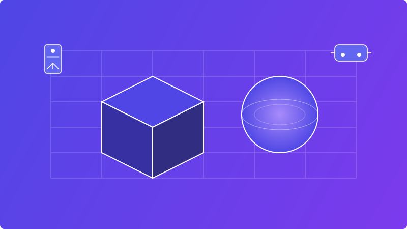

# 🌆 T2V Technology Showcase Website

### _Modern corporate website with stunning 3D elements and Tokyo-inspired design_

  

 

## 📋 Project Overview

**T2V Technology Showcase** is a cutting-edge corporate website built with the latest web technologies. It features Tokyo-inspired visual elements, interactive 3D models, and fluid animations that create an immersive user experience.

> "We are dedicated to providing the best gaming, AR, VR, simulation, applications, and IoT experiences for our customers. We are constantly pushing the envelope when it comes to innovation and technology."

### 🚀 Key Features

-   ✨ **Interactive 3D Model** - Tokyo city model with realistic animations
-   🌟 **Particle System** - 30 animated particles with Tokyo-inspired colors
-   📱 **Responsive Design** - Optimized for mobile, tablet, and desktop
-   🎭 **Smooth Animations** - Elegant page transitions and micro-interactions
-   🔄 **Client-side Rendering** - For seamless 3D components with fallback states

  

## 🛠️ Technology Stack

| Category         | Technologies                      |
| ---------------- | --------------------------------- |
| **Framework**    | Next.js 15+                       |
| **Languages**    | TypeScript, JavaScript            |
| **3D Rendering** | Three.js, React Three Fiber, Drei |
| **Styling**      | TailwindCSS                       |
| **Animations**   | Framer Motion                     |
| **Deployment**   | Vercel                            |

## 📑 Pages & Components

### 1. 🏠 Homepage

-   **Hero Section** - Striking 3D Tokyo model with animated particles
-   **Services Section** - Showcase of T2V technology offerings
-   **Application Section** - Interactive service cards
-   **Process Section** - Visual development workflow
-   **Contact Section** - Streamlined contact form

### 2. 🏢 About Page

-   Company story and mission
-   Team profiles with interactive elements
-   Vision and technology expertise

### 3. 💼 Services Pages

-   **Gaming** - PC, Mobile, Web gaming solutions
-   **AR/VR/Metaverse** - Immersive experience development
-   **IoT Solutions** - Smart device integration
-   **Simulation** - Advanced simulation technology

### 4. 📞 Contact Page

-   Interactive contact form
-   Office locations with map integration
-   Support information

  

## 💰 Investment Overview

### Premium Package

<table>
  <tr>
    <th colspan="4" align="center">📄 Pages & Sections</th>
  </tr>
  <tr>
    <th>Component</th>
    <th>Description</th>
    <th>Hours</th>
    <th>Investment</th>
  </tr>
  <tr>
    <td><b>Homepage Suite</b></td>
    <td>Complete homepage with all sections</td>
    <td>33h</td>
    <td>5,760,000₫</td>
  </tr>
  <tr>
    <td><b>About Page</b></td>
    <td>Company profile, team, vision</td>
    <td>8h</td>
    <td>1,360,000₫</td>
  </tr>
  <tr>
    <td><b>Services Pages (4)</b></td>
    <td>Detailed technology service pages</td>
    <td>12h</td>
    <td>2,040,000₫</td>
  </tr>
  <tr>
    <td><b>Contact Page</b></td>
    <td>Interactive contact form and map</td>
    <td>5h</td>
    <td>850,000₫</td>
  </tr>
  <tr>
    <td><b>Header & Footer</b></td>
    <td>Navigation and site-wide elements</td>
    <td>4h</td>
    <td>680,000₫</td>
  </tr>
  <tr>
    <th colspan="2">Subtotal</th>
    <th>62h</th>
    <th>10,690,000₫</th>
  </tr>
</table>

<table>
  <tr>
    <th colspan="4" align="center">⚙️ Technical Components</th>
  </tr>
  <tr>
    <th>Component</th>
    <th>Description</th>
    <th>Hours</th>
    <th>Investment</th>
  </tr>
  <tr>
    <td><b>3D Integration</b></td>
    <td>Three.js setup, model optimization</td>
    <td>8h</td>
    <td>1,600,000₫</td>
  </tr>
  <tr>
    <td><b>Performance</b></td>
    <td>Optimization, lazy loading</td>
    <td>4h</td>
    <td>680,000₫</td>
  </tr>
  <tr>
    <td><b>Responsive Design</b></td>
    <td>Mobile testing, adjustments</td>
    <td>4h</td>
    <td>680,000₫</td>
  </tr>
  <tr>
    <td><b>Deployment</b></td>
    <td>Vercel setup, domain config</td>
    <td>2h</td>
    <td>300,000₫</td>
  </tr>
  <tr>
    <th colspan="2">Subtotal</th>
    <th>18h</th>
    <th>3,260,000₫</th>
  </tr>
</table>

### 🎁 Frontend-Only Special Offer

  <h3>Total Regular Investment: 13,950,000₫</h3>
  <h2>🔥 Special Package Price: 9,000,000₫ 🔥</h2>
  
<i>Limited time offer for frontend-only implementation</i>

### ✅ What's Included

-   All pages and sections detailed above
-   3D model integration and optimization
-   Responsive design for all devices
-   Deployment to Vercel
-   1 month of free support and bug fixes

### 🎉 Bonus Features (Free)

-   SEO optimization
-   Social media preview cards
-   Loading animations
-   Basic analytics setup

## 📅 Project Timeline

-   **Development**: 2-3 weeks
-   **Testing & Refinement**: 3-5 days
-   **Deployment**: 1-2 days

## 💳 Payment Terms

-   **Initial Payment**: 40% (3,600,000₫)
-   **Progress Payment**: 40% upon completion of Homepage and About page
-   **Final Payment**: 20% upon project completion and deployment

## 📞 Contact

For inquiries about this project, please contact:

<table>
  <tr>
    <td><b>Email:</b></td>
    <td>support@t2v.com</td>
  </tr>
  <tr>
    <td><b>Phone:</b></td>
    <td>+84 xxx xxx xxx</td>
  </tr>
  <tr>
    <td><b>Website:</b></td>
    <td>www.t2v.com</td>
  </tr>
</table>

---

© 2025 T2V Technology. All rights reserved.

